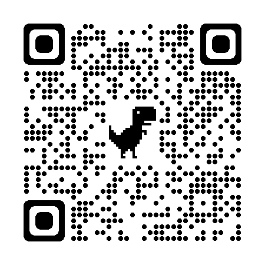

# Pizzatimer

*Application to start a timer for preparing a frozen pizza. *

<!-- 

 -->

## Try it out
Pizzatimer is hosted on [Github Pages](https://axeljaeger.github.io/pizzatimer/). There, you can try out the application and if you like it, you can install the app using your browsers PWA installation mechanism.

<!-- You can also try out the components individually in 
[Storybook](https://main--64ecff17a1f3bdc4e2c65141.chromatic.com). -->

## Platform support
The technical foundation is the [Barcode Detection API](https://developer.mozilla.org/en-US/docs/Web/API/Barcode_Detection_API). This API is only supported on Chrome, Edge and Opera. The application has been successfully tested on both Mac and Android.

## Development
Litra is developed using Typescript, Angular and Angular Material.